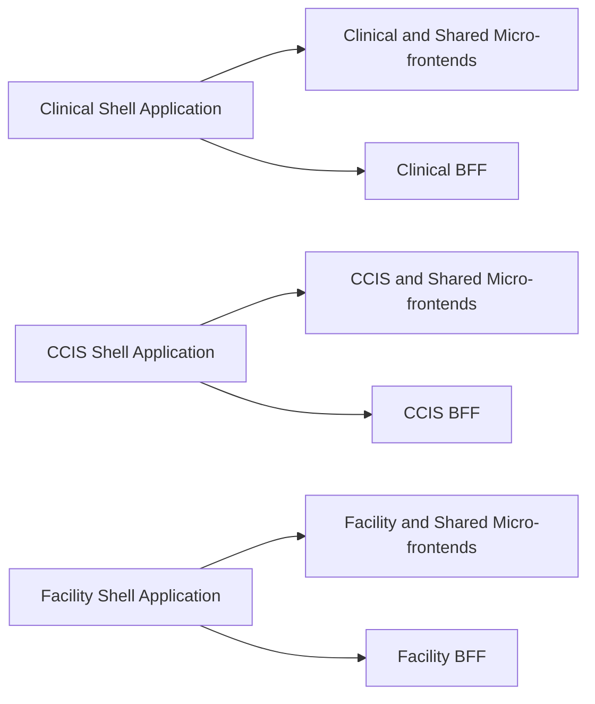

# Clinical Platform: One-Page Project Plan

## What We Are Building

We will deliver three applications: Clinical, CCIS, and Facility. Each application will support its own users and business needs, but all three will be built from the same shared foundation(Shell).

The applications will run separately so each team can deliver at its own pace. Shared features and standards will give users a consistent experience across all three.

## How It Will Work

Each application will be assembled from smaller feature building blocks called **micro-frontends**. A micro-frontend is a self-contained part of the user experience, such as patient search, navigation, notifications, or facility management.

Each shell application will also have a **backend for frontend (BFF)**. The BFF is the service layer between the screens that users see and the wider set of backend systems. It gives each application the information it needs in a form that is easy and safe to use.

### Starting point: three applications

Clinical, CCIS, and Facility will each have:

- Their own application and BFF.
- Features designed for their users and workflows.
- Access to shared features such as sign-in, navigation, notifications, and common design elements.
- Independent release schedules, so one team does not have to wait for the others.

## One Shared GitHub Repository

The shells and all micro-frontends will live in the same GitHub repository. Keeping the related code together will make it easier for teams to develop and test changes across the applications, reuse shared features, and understand how the parts work together.

The applications will also share the same deployment scripts and quality checks. This reduces duplicated work and helps each team follow the same release process while still allowing features to be released independently.

A shared repository also supports AI-assisted development. AI agents will have the project structure, standards, shared code, and related applications in one place, which gives them better context to make consistent changes, find affected areas, and validate their work.

## Delivery Plan

Management can estimate and schedule each phase after its scope, owners, dependencies, and approval needs are confirmed.

| Phase                                   | Main Work                                                                                                                                                                                                                     | Phase Complete When                                                                                                |
| --------------------------------------- | ----------------------------------------------------------------------------------------------------------------------------------------------------------------------------------------------------------------------------- | ------------------------------------------------------------------------------------------------------------------ |
| **1. Experience and technical design**  | Agree how the three applications will look and work, define the first micro-frontends and BFF responsibilities, and document security, accessibility, data, and integration needs.                                            | Designs and delivery requirements are ready for development.                                                       |
| **2. Shared foundation**                | Build the common shell capabilities for sign-in, navigation, page layout, shared design, error handling, monitoring, and communication between micro-frontends.                                                               | A working shell can load and run a sample micro-frontend safely.                                                   |
| **3. Development and deployment setup** | Set up the shared GitHub workflows, automated tests, environments, quality checks, and release approvals. Publish versioned micro-frontends to Azure Blob Storage and deploy shell containers to Kubernetes.                  | A tested sample change can move through each environment and be rolled back.                                       |
| **4. CCIS first release**               | Build the CCIS shell, its first landing-page micro-frontend, and the initial CCIS BFF connection. Test the complete journey, security, accessibility, performance, monitoring, and rollback process.                          | CCIS users and business, security, and operational owners approve the first release.                               |
| **5. CCIS production rollout**          | Release CCIS in controlled stages, monitor usage and service health, resolve issues, and expand access when results are stable.                                                                                               | The CCIS shell and landing page are stable in production and the shared approach is proven.                        |
| **6. Facility first release**           | Reuse the proven foundation to build and release the Facility shell, landing-page micro-frontend, and initial Facility BFF connection. Apply the same testing, approval, deployment, and rollback process used for CCIS.      | The Facility shell and landing page are stable in production.                                                      |
| **7. Clinical first release**           | Reuse the same approach to build and release the Clinical shell, landing-page micro-frontend, and initial Clinical BFF connection. Complete the required clinical-safety, testing, approval, deployment, and rollback checks. | The Clinical shell and landing page are stable in production.                                                      |
| **8. Port remaining features**          | Prioritise existing CCIS, Facility, and Clinical features, move them into micro-frontends in manageable batches, connect them to the relevant BFF, and release each batch through the same quality process.                   | The agreed priority features have moved to the new applications and their previous versions can be retired safely. |
| **9. Ongoing improvement**              | Use feedback and service data to improve journeys, add features, reduce duplication, and increase reuse across the three applications.                                                                                        | Work continues through the normal product planning cycle.                                                          |

Dates will be agreed once the scope, team capacity, regulatory needs, and dependencies on other systems are confirmed.

## Future Option: One Application

Combining Clinical, CCIS, and Facility is a separate future initiative, not part of this delivery plan. The shared foundation and reusable features will keep that option open.

If the organisation decides to proceed, the three applications and their BFFs can be brought together into one application and one BFF. That work would have its own business case, scope, timeline, risks, and approval process.

## What Will Guide Our Decisions

- Users should see a consistent experience across Clinical, CCIS, and Facility.
- Teams should be able to deliver changes without unnecessary coordination or delays.
- Shared features should be built once and reused.
- A problem in one feature should not bring down the whole application.
- Security and access checks must apply at every stage.
- Clinical, CCIS, and Facility must retain clear ownership of their features and services.

## How We Will Measure Success

- Each domain team can release features without waiting for all other teams.
- Shared features behave consistently in all three applications.
- Users can continue working when a non-critical feature is unavailable.
- Security, accessibility, performance, reliability, and clinical-safety checks pass before each major release.
- User feedback and live service data show that each application meets the needs of its users.

## Main Risks

| Risk                                                     | How We Will Manage It                                                         |
| -------------------------------------------------------- | ----------------------------------------------------------------------------- |
| The three applications become too different              | Use one shared foundation, common design standards, and joint quality checks. |
| Shared features work well for one area but not another   | Test shared features in Clinical, CCIS, and Facility before release.          |
| Teams become dependent on each other's release schedules | Keep features independently testable and releasable, with clear ownership.    |
| Different feature versions do not work well together     | Test each approved set of features before it reaches users.                   |

## Frequently Asked Questions

### Why are we starting with three applications?

Clinical, CCIS, and Facility serve different users and workflows. Starting separately allows each team to make progress at the right pace while still using the same shared foundation.

### Why does each application need its own BFF at first?

Each area needs different information from backend systems. A dedicated BFF allows each team to shape that information around its users without waiting for every other domain to agree on a single solution.

### Will shared features be copied three times?

No. Features such as navigation or notifications will have one maintained version that can be used by all three applications.

### How will releases be managed safely?

Each feature will be tested and released independently. Approved sets of features will move through development, test, demonstration, and production environments. We will be able to return to a previous working set if needed.

### How will sign-in and access work?

The application will manage sign-in once and provide each feature with the user information it needs. The BFF and the existing backend systems will still check that the user has permission for every protected action.

### How will we stop the feature teams from becoming dependent on each other?

Each feature will have a clear purpose and a documented way to exchange information. Teams will not rely on the private workings of another feature, which allows them to make changes independently.

### Are we tied to one technology supplier or build tool?

No. The design separates business features from the tools used to assemble and release them. Changing those tools would still require planned work, but it should not require us to rewrite the Clinical, CCIS, or Facility features.
